# Sistema de Recomendación con GitHub Copilot

## 📄 Descripción del Proyecto

Este repositorio documenta el proceso de creación de un sistema de recomendación básico en Python utilizando **GitHub Copilot** como herramienta de asistencia de programación. El objetivo es explorar las capacidades de la Inteligencia Artificial generativa en el desarrollo de código, específicamente en el uso de librerías como `pandas` y `scikit-learn`.

El sistema resultante:

- Carga y preprocesa un catálogo de ejemplo de películas (características: `action`, `comedy`, `drama`, `runtime_minutes`).
- Entrena un modelo `KNeighborsClassifier` dentro de un `Pipeline` de `scikit-learn` (imputación + estandarización).
- Evalúa la precisión (*accuracy*) del modelo sobre un conjunto de prueba.
- Expone una función de recomendación que sugiere títulos según las preferencias entregadas.

> 🤖 Todo el código de `recommendation_system.py` fue generado por **GitHub Copilot (modo agente del chat)** a partir de prompts y comentarios descriptivos en español, y luego revisado y validado manualmente (sintaxis correcta y sin diagnósticos de Pylance).

### Estructura del repositorio

```
AI_Proyect/
├── .gitignore                  # Agregado en el commit de código (creado con Copilot)
├── README.md                   # Este documento
├── recommendation_system.py    # Código generado con GitHub Copilot
├── requirements.txt            # Dependencias (pandas, scikit-learn)
└── capturas/                   # 21 capturas de evidencia del proceso
```

---

## 🚀 Proceso de Desarrollo

### Paso 1: Configuración de la cuenta y creación del repositorio

Se accedió a GitHub con una cuenta de estudiante habilitada para GitHub Copilot (organización `InacapLeandroParrao`). Posteriormente se creó un nuevo repositorio llamado `AI_Proyect`, configurándolo como **público** e inicializándolo con un archivo `README.md`. (El `.gitignore` se agregó más adelante, en el commit del Paso 4.)

> 📸 **Evidencia:** organización antes de crear el repositorio.
> 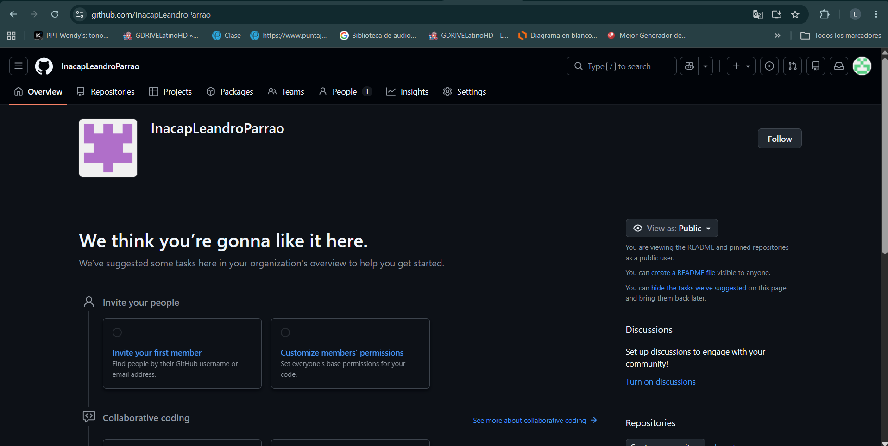

> 📸 **Evidencia:** la organización aún no tiene repositorios.
> 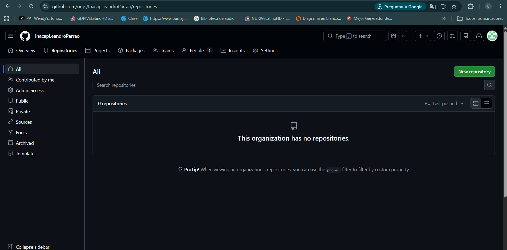

> 📸 **Evidencia:** formulario de creación con el nombre `AI_Proyect`.
> 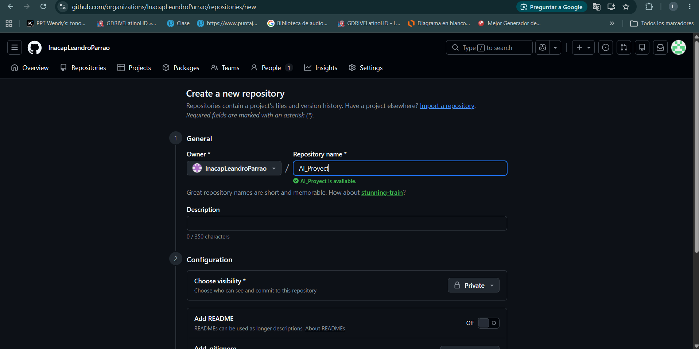

> 📸 **Evidencia:** configuración final: visibilidad **Public** e inicialización con `README.md`.
> 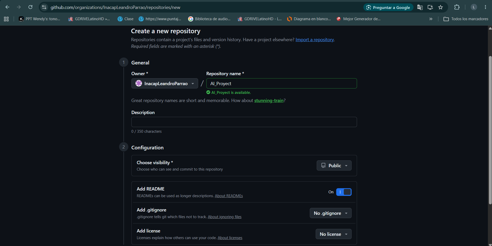

> 📸 **Evidencia:** repositorio creado con su commit inicial.
> 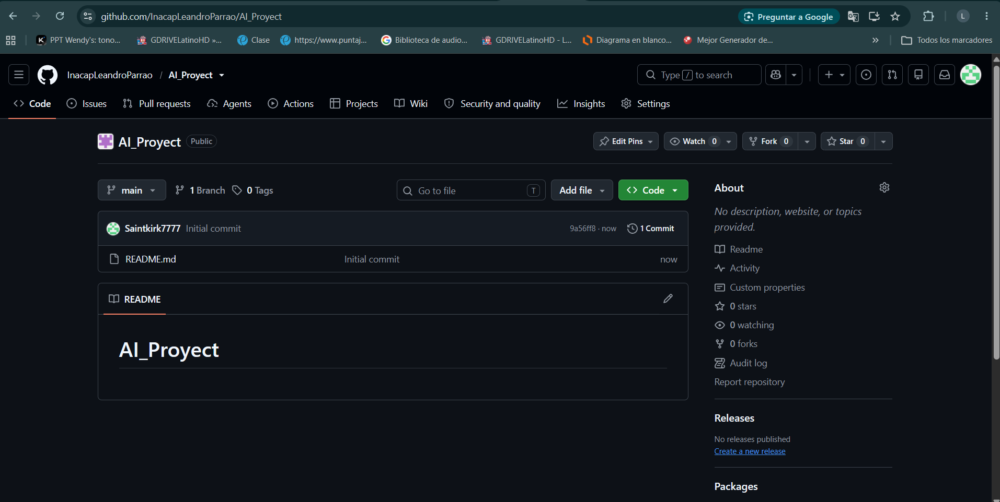

### Paso 2: Clonación del repositorio en Visual Studio Code

Se utilizó el terminal integrado de Visual Studio Code (PowerShell) para clonar el repositorio de forma local y comenzar a trabajar en el entorno de desarrollo:

```bash
git clone https://github.com/InacapLeandroParrao/AI_Proyect.git
cd AI_Proyect
```

> 📸 **Evidencia:** terminal abierto en la carpeta de trabajo, antes de clonar.
> 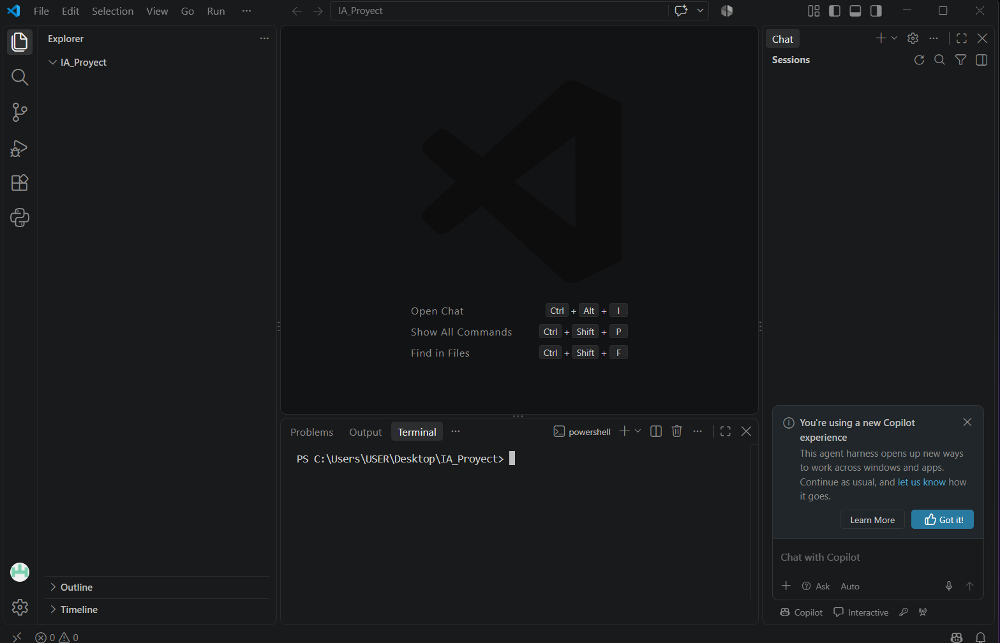

> 📸 **Evidencia:** comando `git clone` escrito en el terminal.
> 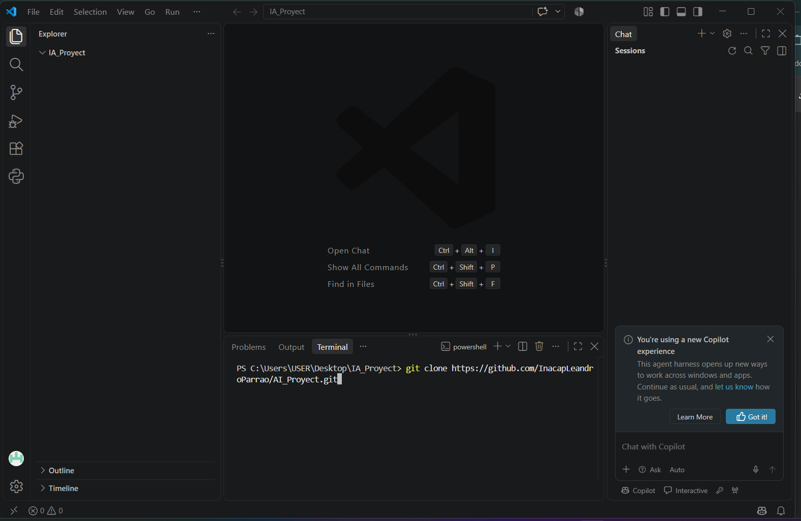

> 📸 **Evidencia:** clonación exitosa y carpeta `AI_Proyect` con su `README.md` en el Explorer.
> 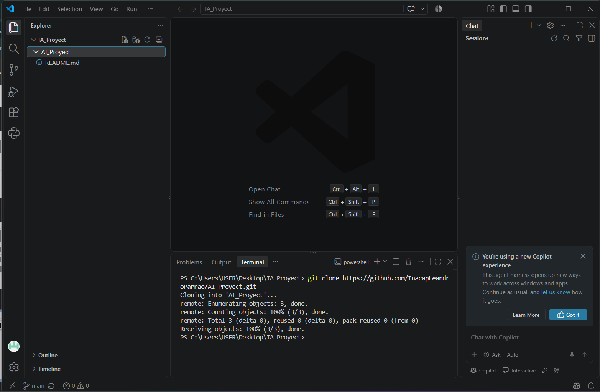

> 📸 **Evidencia:** entrada al directorio del repositorio clonado.
> 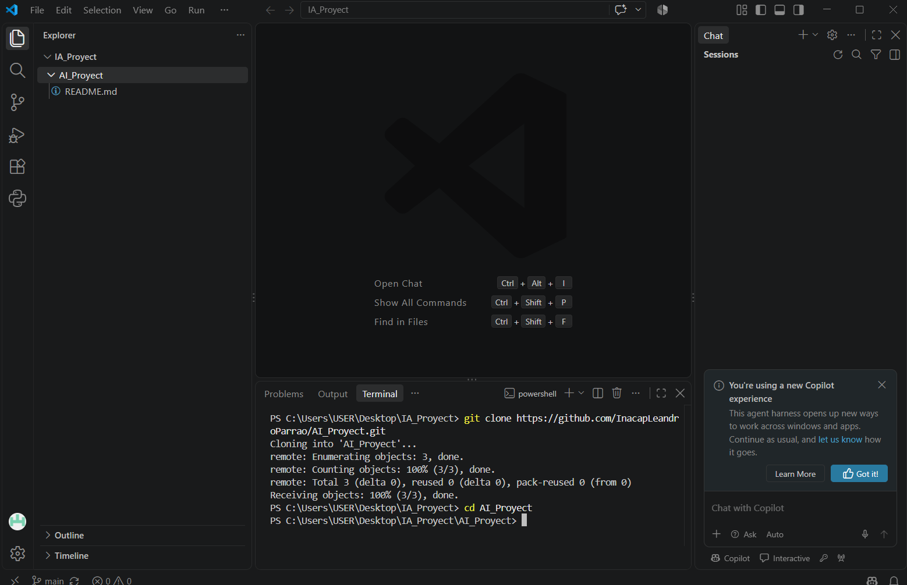

### Paso 3: Generación de código con GitHub Copilot

Se creó el archivo `recommendation_system.py` y se utilizó el **chat de GitHub Copilot en modo agente** con el siguiente prompt:

> *"Crea un sistema de recomendación básico en Python usando KNeighborsClassifier de sklearn. Incluye carga de datos con pandas, preprocesamiento, entrenamiento, evaluación de precisión y una función de recomendación."*

Copilot completó la tarea en 5 pasos (~16 s) y generó las siguientes secciones:

1. Importación de librerías (`pandas`, `sklearn`: `KNeighborsClassifier`, `Pipeline`, `StandardScaler`, `SimpleImputer`, `train_test_split`, `accuracy_score`).
2. Carga y preprocesamiento de datos (catálogo de ejemplo embebido como CSV).
3. División en conjuntos de entrenamiento y prueba.
4. Creación y entrenamiento del modelo (`KNeighborsClassifier` dentro de un `Pipeline`).
5. Evaluación del modelo (accuracy) y función de recomendación.

En una segunda iteración se le pidió incluir los comentarios descriptivos de cada sección en el código (*"# Importar las librerías necesarias", "Realizar predicciones", "Evaluar el modelo", "Función de recomendación"*, entre otros), y posteriormente se le solicitó crear el archivo `.gitignore` del proyecto.

> 📸 **Evidencia:** archivo `recommendation_system.py` creado, listo para recibir código de Copilot.
> 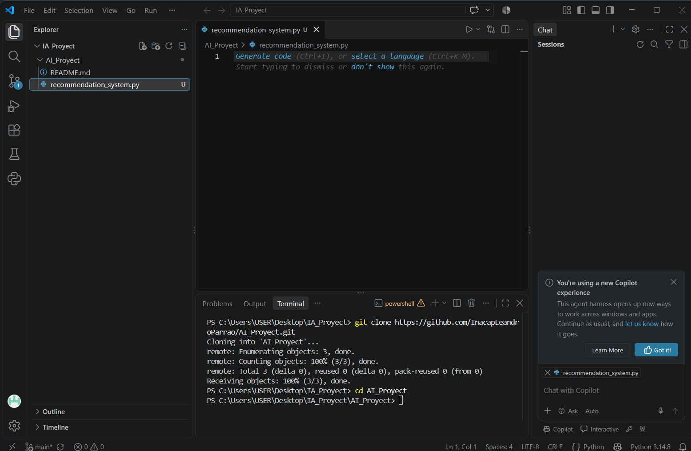

> 📸 **Evidencia:** prompt escrito en el chat de Copilot antes de enviarlo.
> 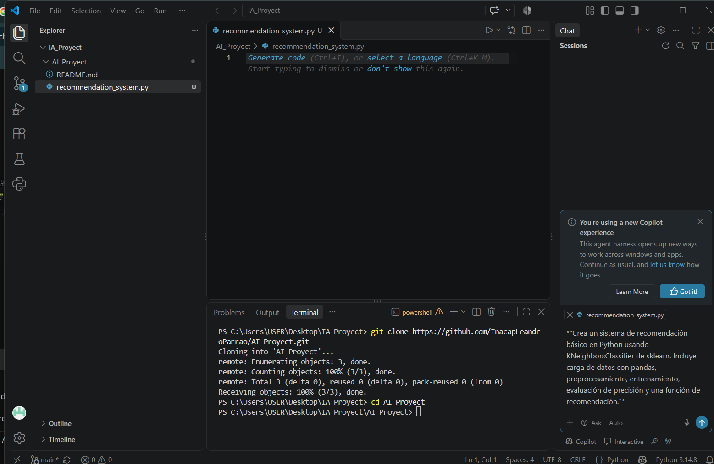

> 📸 **Evidencia:** Copilot generando el código en modo agente (diff parcial +179 −1 y ejecución de herramientas).
> 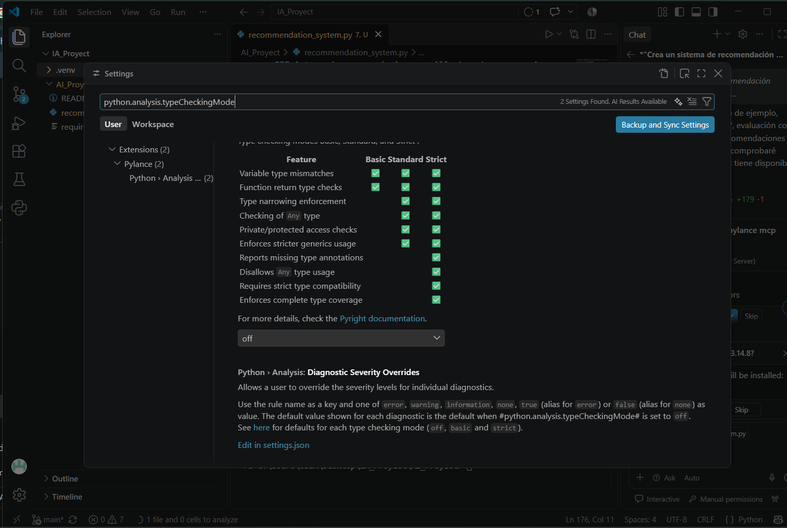

> 📸 **Evidencia:** código generado — inicio del archivo (imports y datos de ejemplo).
> 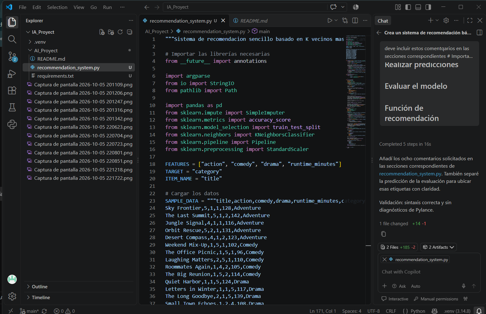

> 📸 **Evidencia:** código generado — cierre del archivo (`main()`, preferencias y función de recomendación) con el resumen del agente.
> 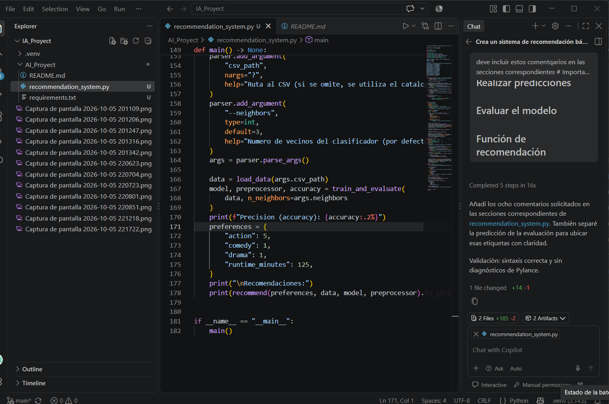

> 📸 **Evidencia:** Copilot creando el archivo `.gitignore` del proyecto.
> 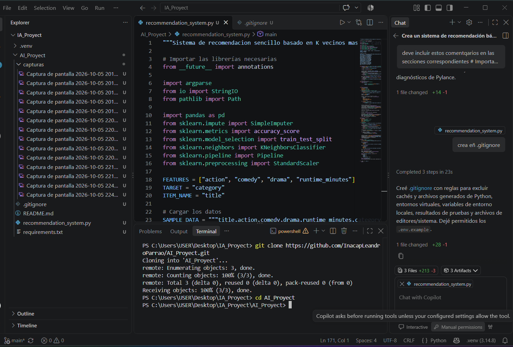

### Paso 4: Commit y Push a GitHub

Una vez generado y revisado el código, se agregaron los archivos al índice de Git, se realizó un commit descriptivo y se subieron los cambios al repositorio remoto:

```bash
git add .
git commit -m "Agregado recommendation_system.py generado con GitHub Copilot"
git push origin main
```

El commit incluyó `recommendation_system.py`, `requirements.txt`, `.gitignore` y las capturas de evidencia organizadas en `capturas/`. Un commit posterior renombró las capturas a su nomenclatura final (`pasoX_NN_descripcion.png`).

> 📸 **Evidencia:** `git add .` y `git status --short` con todos los archivos preparados (`A`).
> 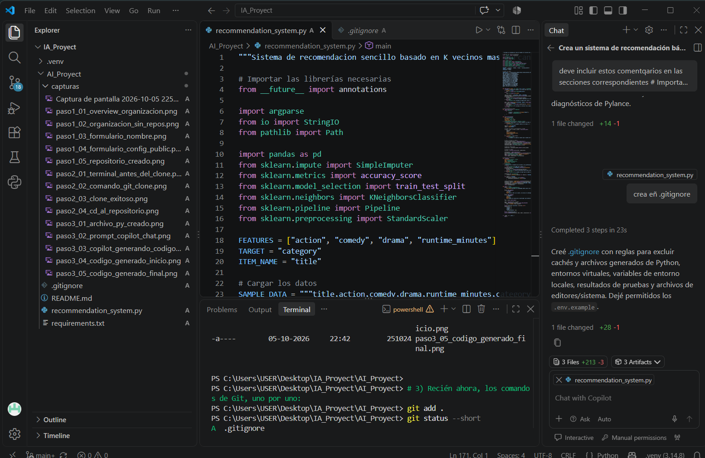

> 📸 **Evidencia:** push exitoso del commit de código (`9a56ff8..7b45366  main -> main`, 24 objetos, 2.81 MiB).
> 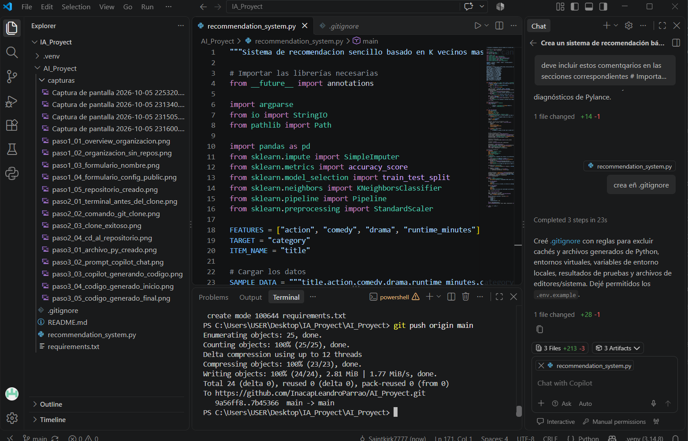

> 📸 **Evidencia:** push del commit de limpieza de nombres (`7b45366..0715445  main -> main`).
> 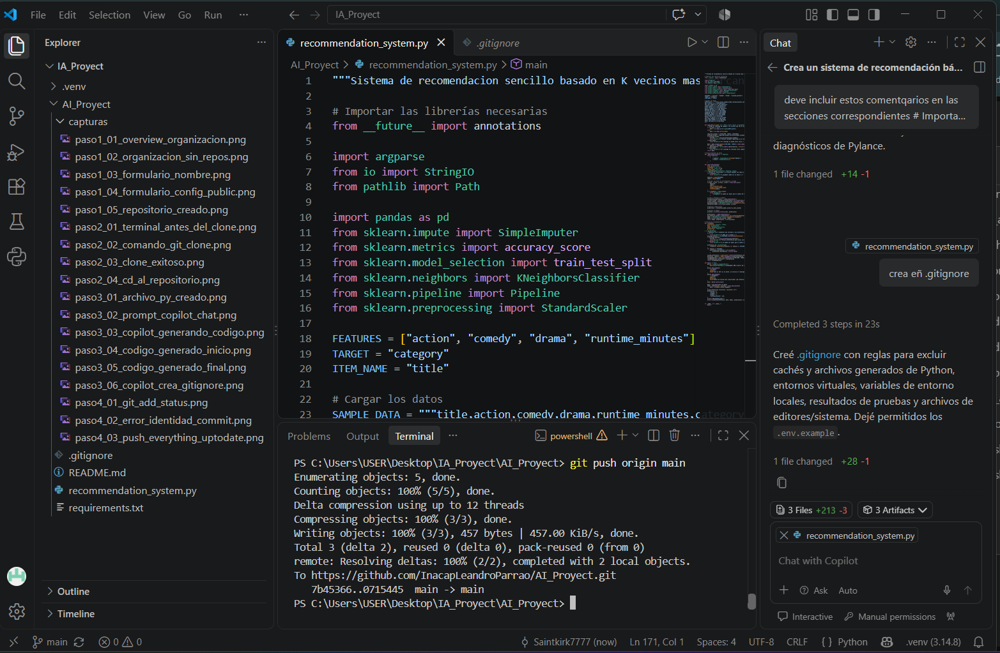

> 📸 **Evidencia:** repositorio en GitHub con el código, el `.gitignore`, el `requirements.txt` y la carpeta `capturas/` ya publicados.
> 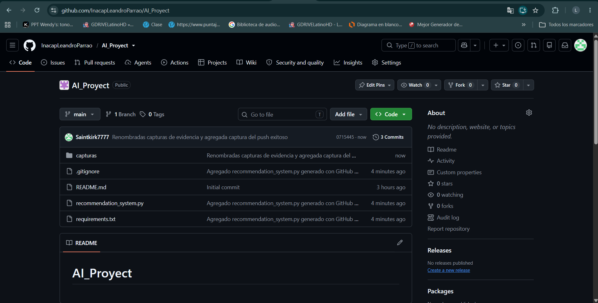

---

## 🧯 Problemas encontrados y soluciones

| # | Problema | Causa | Solución | Evidencia |
|---|----------|-------|----------|-----------|
| 1 | `fatal: not a git repository (or any of the parent directories): .git` | Se ejecutó `git add .` desde la carpeta de trabajo (`IA_Proyect`), fuera del repositorio clonado. | Entrar al directorio del repo (`cd AI_Proyect`) antes de usar Git. | — |
| 2 | `Author identity unknown ... fatal: unable to auto-detect email address` | Git no tenía identidad configurada en el equipo (el commit inicial lo había creado la web de GitHub). | `git config --global user.name "Saintkirk7777"` y `git config --global user.email "Saintkirk7777@users.noreply.github.com"`. | 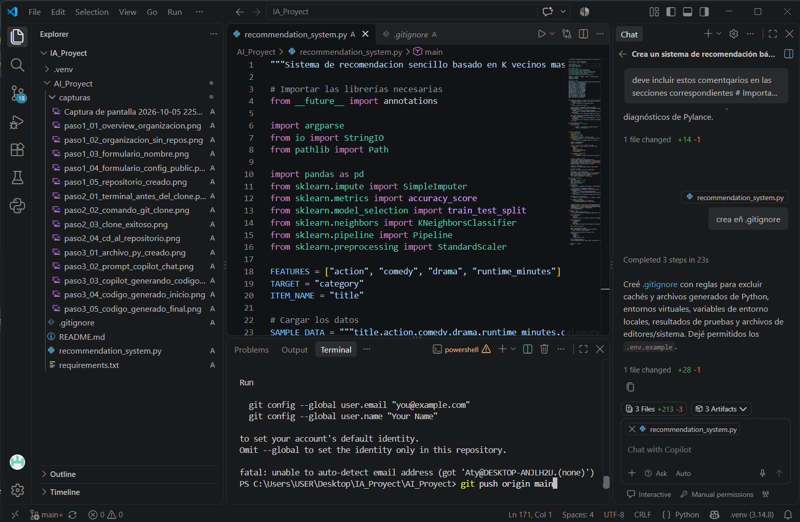 |
| 3 | `Everything up-to-date` al hacer push sin ver cambios en GitHub | Consecuencia del problema 2: el commit no llegó a crearse, por lo que no había nada que subir. | Configurar la identidad y repetir `git commit` y `git push`. | 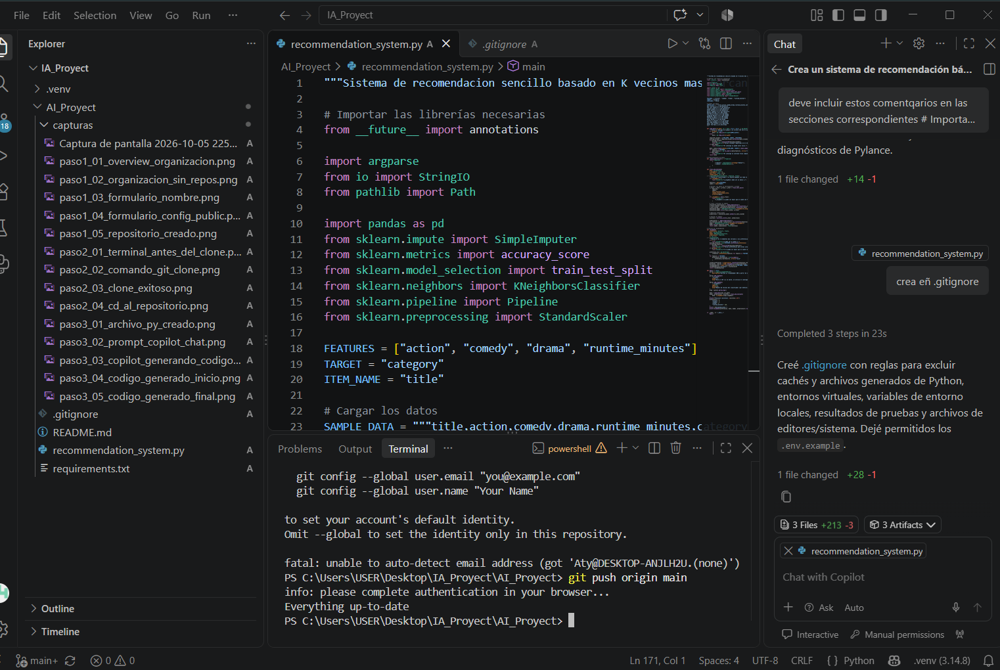 |
| 4 | Repositorio inicializado sin `.gitignore` teniendo un entorno virtual (`.venv`) en el equipo | En el formulario de creación se eligió "No .gitignore". | Se creó un `.gitignore` local (con ayuda de Copilot) que excluye `.venv/`, `__pycache__/`, secretos y cachés, y se incluyó en el commit. |  |

---

## 🧠 Reflexiones sobre el uso de GitHub Copilot

- **Velocidad:** el sistema completo (carga, preprocesamiento, entrenamiento, evaluación y recomendación) fue generado en ~16 segundos de ejecución del agente, más el tiempo de revisión humana.
- **El prompt importa:** un prompt específico (modelo, librerías y secciones esperadas) produjo una estructura de código coherente y funcional a la primera.
- **La revisión humana es indispensable:** Copilot propone, pero la validación (sintaxis, diagnósticos de Pylance, prueba del script) y las decisiones de ingeniería (`.gitignore`, nomenclatura, commits) siguen siendo responsabilidad del desarrollador.
- **El entorno completo sigue siendo humano:** la mayoría de los tropiezos del proyecto no fueron de código, sino de flujo Git (identidad, directorio de trabajo), lo que refuerza que la IA acelera la programación pero no reemplaza el dominio de las herramientas de desarrollo.

---

## ⚙️ Requisitos y ejecución

```bash
pip install -r requirements.txt
python recommendation_system.py --neighbors 3
```

S
